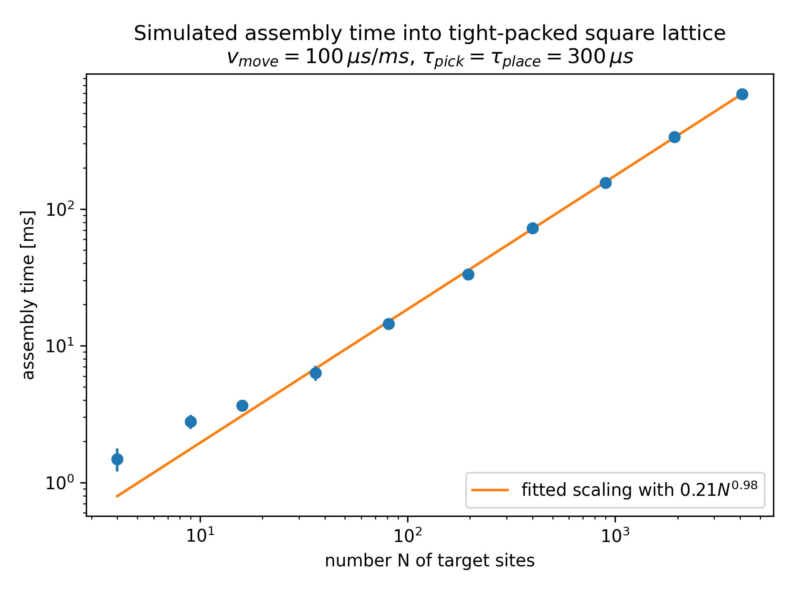

# Microscopic atom sorter

Simulate moves to sort randomly loaded tweezers into packed shapes with a movable tweezer.


## Install and test
Using `pipenv`:
```
# clone repo and cd into folder

# install everything from requirements.txt into venv
pipenv install

# enter venv
pipenv shell

# install this package
pip install -e .

# run the tests
pytest tests/
```


## Example 1: Scaling
Packing randomly loaded tweezer configurations into tightly packed squares is hard.
But how does it scale?
```
# in the venv
# takes some minutes and up to 2GB system memory per thread
python examples/packed_square_scaling.py
```

### Result:
Generates `example_scaling_behavior.mp4`.




## Example 2: Animation
Animation of packing a 20x20 array into a 10x10 square.
Generates `animation.mp4`.
```
# in the venv
python examples/simulate_and_animate.py
```

### Result:
Generates `animation.mp4`.


